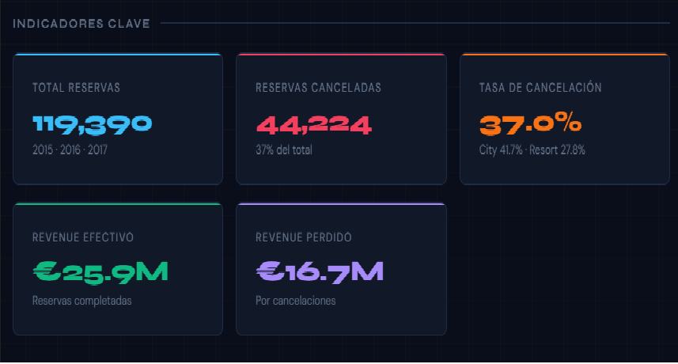
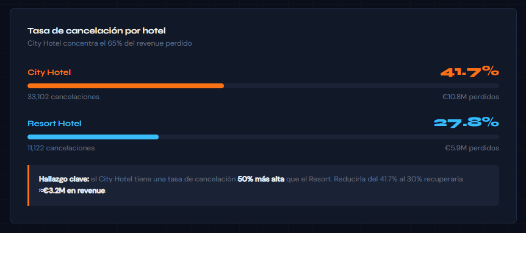
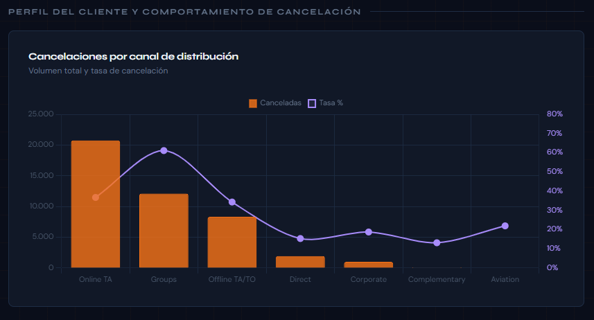
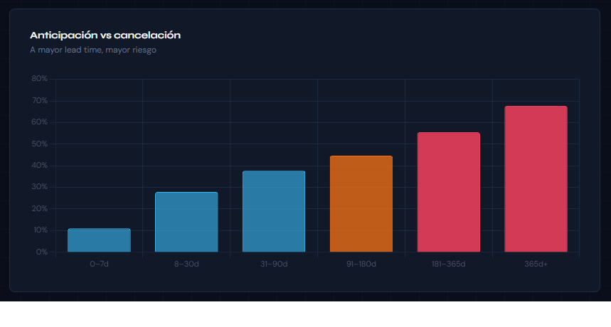
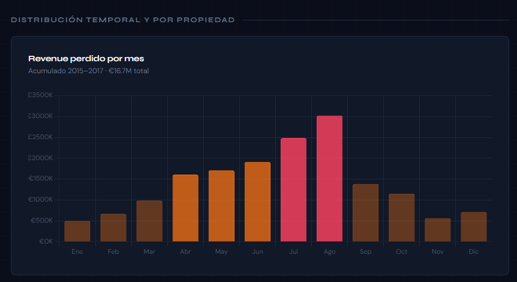

# Hotel Booking Analysis

## Problema de negocio

El análisis de cancelaciones en reservas hoteleras es clave para la rentabilidad del sector. Este proyecto busca identificar los factores que impulsan las cancelaciones de reservas, cuantificar su impacto financiero y proponer acciones basadas en datos para reducir pérdidas económicas.

El análisis revela un impacto significativo de las cancelaciones, generando oportunidades claras de optimización operativa y comercial.

---

## Dataset

- Fuente: Hotel Booking Demand Dataset
- Periodo: 2015 - 2017
- Registros: ~119,000 reservas
- Variables relacionadas con tipo de cliente, canal de reserva, anticipación, cancelaciones y revenue

Se trabajó con dos formatos de datos:
- Archivo CSV original
- Base de datos SQLite para consultas SQL

---

## Herramientas utilizadas

- Python (Pandas, NumPy, Matplotlib, Seaborn)
- SQL (SQLite)
- Tableau Public
- Jupyter Notebook

---

## Arquitectura del proyecto

- `data/` → Dataset original y base de datos
- `notebooks/` → Análisis exploratorio y modelado
- `dashboard/` → Dashboard exportado en HTML desde Tableau
- `images/` → Visualizaciones clave del análisis

---

## Hallazgos principales

- El **37% de las reservas fueron canceladas** en el período analizado.
- El **City Hotel concentra el 41.7% de cancelaciones**, frente al 27.8% del Resort Hotel.
- El **revenue perdido asciende a €16,721,837**, con mayor impacto en City Hotel (65.1% del total).
- El cliente tipo **Transient con reservas vía Online TA y alta anticipación presenta mayor probabilidad de cancelación**.
- El **historial de cancelaciones es el predictor más fuerte de comportamiento futuro (94% de recurrencia)**.
- El **53.7% de las cancelaciones ocurre en temporada alta y media**, cuando el ADR es más elevado.

---

## Visualizaciones

### Indicadores clave

### Cancelaciones por hotel

### Cancelaciones por canal

### Anticipación de cancelación

### Revenue perdido

---

## Dashboard

El dashboard interactivo fue desarrollado en Tableau y permite explorar:

- Tasa de cancelación
- Revenue perdido
- ADR promedio
- Segmentación por hotel, canal y tipo de cliente

📊 Archivo local: `dashboard/hotel-dashboard.html`

---

## Recomendaciones estratégicas

- Implementar depósitos obligatorios para reservas de alto riesgo.
- Reducir dependencia de canales con alta cancelación (Online TA).
- Activar estrategias de retención en temporada alta.
- Crear sistema de alertas para clientes con historial de cancelación.

---

## Impacto potencial

La reducción de la tasa de cancelación del City Hotel del 41.7% al 30% podría representar una recuperación estimada de **€3.2M en revenue**, mediante la implementación de políticas basadas en datos.

---

## Autor

Albert F. Mendoza  
Analista de Datos Jr. Administrador Público en transición a la Ciencia de Datos. 
Portafolio: https://albert777mendoza.github.io  
LinkedIn: https://linkedin.com
